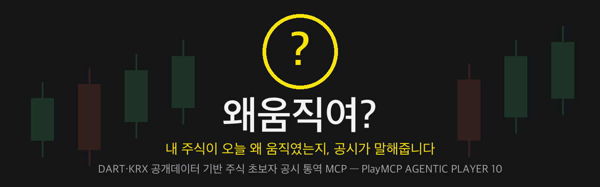
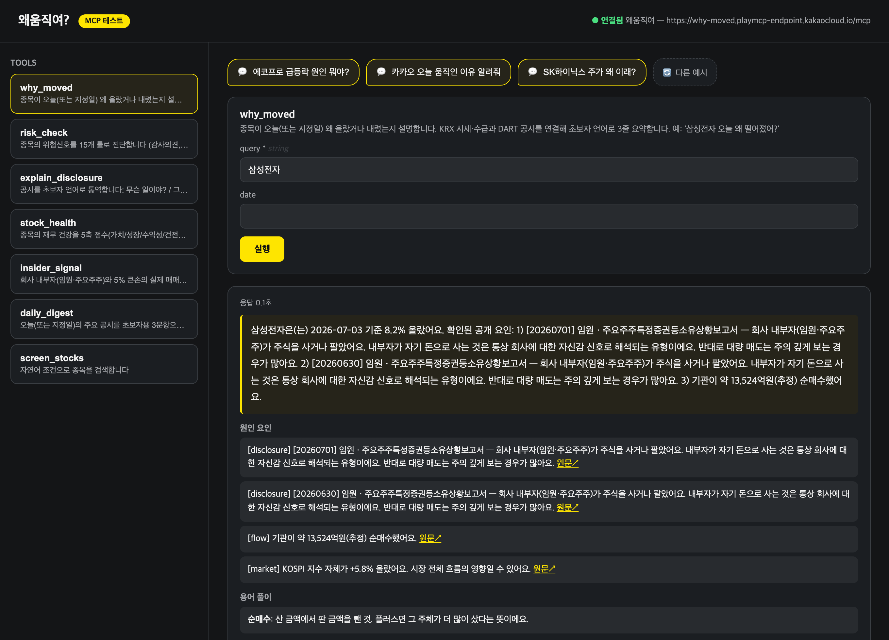
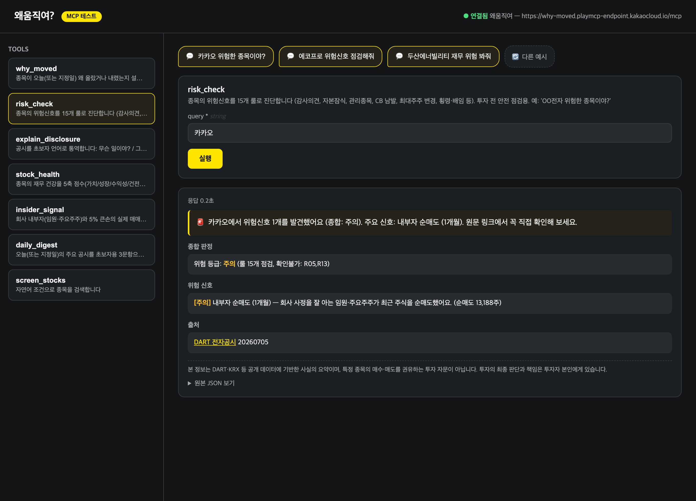
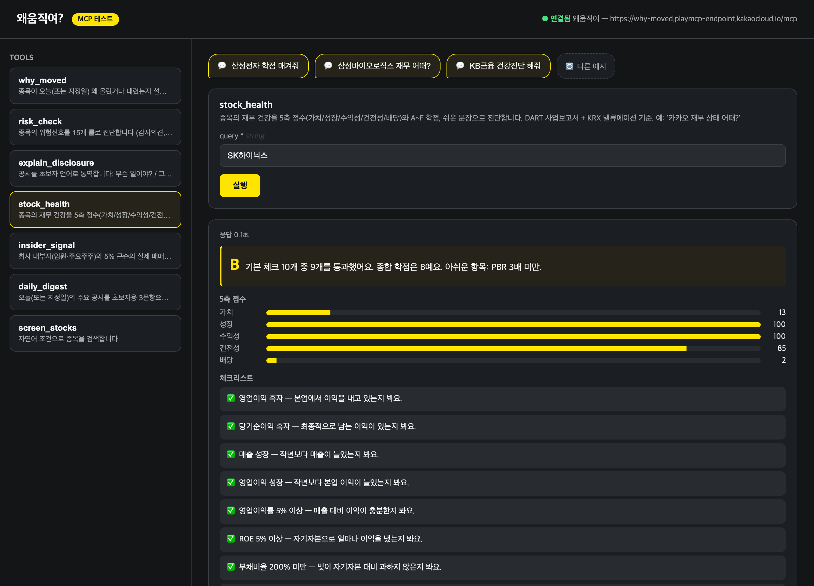
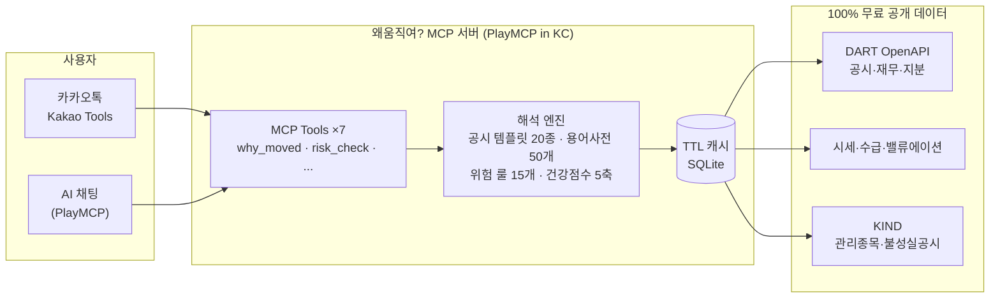
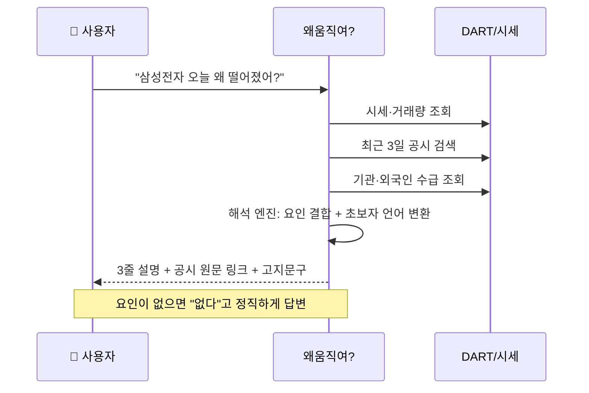

<div align="center">



# 왜움직여? — 주식 초보자를 위한 공시 통역사

**"내 주식이 오늘 왜 떨어졌지?"** — 1,400만 개인투자자의 1등 질문에, 공시가 답합니다.

[](tests/)
[](tests/)
[](src/why_moved/tools/)
[](pyproject.toml)
[](src/why_moved/server.py)
[](https://playmcp.kakao.com)

🏆 **카카오 PlayMCP AGENTIC PLAYER 10 출품작** (과학기술정보통신부 후원)

</div>

---

## 💬 30초 미리보기

> 👤 **삼성전자 오늘 왜 떨어졌어?**
>
> 🤖 삼성전자은(는) 2026-07-03 기준 **8.2% 올랐어요.** 확인된 공개 요인:
> 1) [20260701] 임원·주요주주 소유상황보고서 — 회사 내부자가 주식을 사거나 팔았어요. 내부자가 자기 돈으로 사는 것은 통상 회사에 대한 자신감 신호로 해석되는 유형이에요.
> 2) 기관이 약 **13,524억원(추정) 순매수**했어요.
> 3) KOSPI 지수 자체가 +5.8% 올랐어요. 시장 전체 흐름의 영향일 수 있어요.
> 📎 [공시 원문 보기 (DART)](https://dart.fss.or.kr) · *20260703 종가 기준*

> 👤 **카카오 위험한 종목이야?**
>
> 🤖 🚨 카카오에서 위험신호 **1개**를 발견했어요 (종합: **주의**).
> **[주의] 내부자 순매도 (1개월)** — 회사 사정을 잘 아는 임원·주요주주가 최근 주식을 순매도했어요. (순매도 13,188주)
> 룰 15개 점검 완료. 원문 링크에서 꼭 직접 확인해 보세요.

*위 답변은 배포 중인 실제 서버의 응답 그대로입니다 — 조작 없음.*

---

## 😰 문제: 정보는 공개돼 있는데, 왜 아무도 못 읽을까

한국 개인투자자는 **1,400만 명**. 그런데 유상증자, 전환사채, 무상감자, 감사의견 거절 —
주가를 좌우하는 정보는 **DART에 100% 무료 공개**되어 있는데도, 전문용어의 벽에 막혀
사실상 기관과 전문가의 전유물입니다.

그 공백을 파고드는 것이 **리딩방과 불법 유사투자자문**입니다.
초보 투자자는 검증 불가능한 "카더라"에 의존하다 유상증자 공시 하나를 못 읽어 손실을 봅니다.

**왜움직여?는 이 정보 비대칭을 해소하는 통역사입니다.**
조회가 아니라 **해석**을, 추천이 아니라 **사실과 경고**를 제공합니다.

---

## 📸 실제 동작 화면

| "왜 움직였어?" — 공시·수급·시장 연결 설명 | "위험해?" — 15가지 위험신호 진단 |
|:---:|:---:|
|  |  |

<div align="center">

**재무 건강진단 — 5축 점수와 A~F 학점, 쉬운 문장 해설**



</div>

직접 테스트: `uv run python webclient/serve.py` → http://localhost:8765

---

## 🔧 7가지 도구

| Tool | 무엇을 하나 | 이렇게 물어보세요 |
|---|---|---|
| 🔍 `why_moved` | 급등락 원인을 공시+수급+시장 흐름으로 3줄 설명 | "삼성전자 오늘 왜 떨어졌어?" |
| 🚨 `risk_check` | 위험신호 15개 룰 진단 (감사의견·자본잠식·관리종목·CB 남발·횡령배임…) | "이 종목 위험한 거 아니야?" |
| 📖 `explain_disclosure` | 공시를 "무슨 일이야? / 그래서 뭐? / 나랑 무슨 상관?" 3문항으로 통역 | "유상증자 공시 쉽게 설명해줘" |
| 🏥 `stock_health` | 재무 건강 5축 점수 + A~F 학점 + 쉬운 문장 | "카카오 재무 상태 어때?" |
| 💰 `insider_signal` | 임원·5% 큰손의 **공시된 실제 매매** 추적 | "임원들이 최근 자기 주식 샀어?" |
| 📰 `daily_digest` | 오늘의 주요 공시를 초보자 눈높이로 요약 | "오늘 중요한 공시 뭐 있어?" |
| 🔎 `screen_stocks` | 자연어 종목 검색 | "배당 4% 이상 PBR 1 이하 코스피" |

---

## 🆚 차별화: "조회"가 아니라 "해석"

공시 데이터를 그대로 보여주는 도구는 이미 있습니다. 왜움직여?는 다릅니다.

| | 기존 공시 조회 도구 | **왜움직여?** |
|---|---|---|
| 질문 | "삼성전자 재무제표 보여줘" | **"삼성전자 오늘 왜 떨어졌어?"** |
| 응답 | 공시 원문·재무 수치 (전문가용) | 초보자 언어 3줄 해석 + 시세·수급 연결 |
| 위험 | 사용자가 스스로 판단 | **15가지 룰이 선제 경고** (상폐·자본잠식·CB 남발) |
| 근거 | — | 모든 답변에 DART 원문 링크 첨부 |

---

## 🛡️ 위험신호 15룰 — 투자자 보호가 핵심 기능

초보자가 당하는 전형적 패턴을 룰로 만들었습니다. ([`engine/risk_rules.py`](src/why_moved/engine/risk_rules.py))

| 심각도 | 룰 |
|---|---|
| 🔴 위험 | 감사의견 비적정 · 자본잠식 · 관리종목 지정 · 횡령/배임 공시 · 상장폐지 사유 |
| 🟠 경고 | 거래정지 이력 · 불성실공시법인 · CB/BW 3회+ 반복 발행 · 최대주주 잦은 변경 |
| 🟡 주의 | 유상증자 반복 · 내부자 순매도 · 3년 연속 영업적자 · 소송 제기 · 공매도 급증 · 이유 없는 거래량 폭증 |

데이터를 확인할 수 없는 룰은 **"확인 불가"로 정직하게 보고**합니다 — 아는 척하지 않습니다.

---

## 🤝 신뢰 설계 — 말이 아니라 코드로

| 원칙 | 구현 (코드 증거) |
|---|---|
| **모든 답변에 출처** | 응답 스키마에 `sources`(DART 원문 링크)·`disclaimer` 필드 강제 — [`common/envelope.py`](src/why_moved/common/envelope.py) |
| **매수·매도 권유 금지** | "매수하세요" 등 권유 표현이 감지되면 응답 자체를 차단하는 서버 안전망 — [`FORBIDDEN_PHRASES`](src/why_moved/common/envelope.py) |
| **환각 금지** | 원인을 못 찾으면 "뚜렷한 공개 요인 없음"이라고 답함 — [`tools/why_moved_tool.py`](src/why_moved/tools/why_moved_tool.py) |
| **개인정보 미수집** | 계좌 연동·로그인 없음. 입력은 종목명뿐 |
| **해석 화법 통제** | 모든 해설은 "통상 ~로 해석되는 유형" 화법 — 예측·단정 배제 ([`engine/disclosure_templates.py`](src/why_moved/engine/disclosure_templates.py)) |

---

## 🏗️ 아키텍처





---

## 🏆 AGENTIC PLAYER 10 — 심사기준 대응

> **예선 심사 중** · 예선 접수 6/15~7/14 → 본선 개발 7/30~8/27 (Kakao Tools 입점) → 사용자 투표 8/31~9/28

| 심사기준 | 왜움직여?의 답 |
|---|---|
| **창의성** | 국내 최초 "공시-시세 연결 통역 + 위험 경고" 에이전트. 조회를 해석으로 바꾼 패러다임 전환. 대상은 1,400만 명 — 파급력이 검증된 문제 |
| **편의성** | 질문 한 번 → 3줄 답변. 전문용어는 등장 즉시 한 줄 풀이. 숫자 하나(학점)·그림 하나(5축)·문장 하나로 압축 |
| **안정성** | 테스트 84건·커버리지 82%, 공식 API + TTL 캐시 + 타임아웃/폴백, 모든 답변이 원문 링크로 검증 가능, 개인정보 미수집 |

**1회차 수상 공식의 계승** — [1회차 MCP Player 10 결산](https://tech.kakao.com/posts/818)에서 수상작들의 공통점은
"일상의 구체적 고통 × 공익성 × 차별화된 공개데이터"였습니다 (보육교사의 행정부담을 던 어린이ZIP,
공공데이터로 육아를 도운 키즈허브, 법령을 통역한 LexiLink…).
왜움직여?는 같은 공식을 금융에 적용합니다: **개미투자자의 고통 × 투자자 보호 공익 × DART 공개데이터.**

---

## 💛 카카오 생태계와의 시너지

**투자 대화는 이미 카카오톡에서 일어나고 있습니다.**
가족 단톡방의 "이 주식 어때?", 친구가 보낸 종목 링크 — 지금 그 대화의 답은 소문과 리딩방이 채우고 있습니다.
왜움직여?는 그 자리에 **검증 가능한 공개데이터 답변**을 공급합니다. 불법 리딩방의 대안이 카카오톡 안에 생기는 것입니다.

- **Kakao Tools 위젯 선제 대응** — 본선 기간(7/30~8/27)에 건강진단 학점 카드·위험신호 배지를 PlayMCP가 예고한 위젯(JSON UI)으로 구현할 준비가 되어 있습니다 (점수·등급 데이터가 이미 구조화 필드로 반환됨)
- **확장 시나리오** — 관심종목 위험공시 알림, 카카오 금융 서비스와의 연계, 카카오 AI 에이전트의 "금융 신뢰 레이어"
- **후원 취지 정합성** — 과기정통부가 추진하는 공공데이터 활용·정보격차 해소를 금융 영역에서 구현

---

## ✅ 품질 지표

| 항목 | 수치 |
|---|---|
| 테스트 | **84건 전부 통과** (룰별 양성/음성, 어댑터 HTTP 모킹, envelope 계약) |
| 커버리지 | **82%** (목표 80%) |
| 실데이터 E2E | 7개 tool 전부 실종목(삼성전자·카카오 등)으로 검증 |
| 배포 검증 | PlayMCP in KC Active — 원격 MCP 프로토콜로 7개 tool 재검증 완료 |
| 규제 방어 | 권유 표현 서버 차단 + 전 응답 고지·출처 (유사투자자문 아님) |

```bash
uv run pytest --cov    # 84 passed, 82% coverage
```

---

## 🚀 실행 방법

```bash
# 1. 의존성 설치
uv sync

# 2. DART API 키 설정 — https://opendart.fss.or.kr 무료 발급 (1분)
cp .env.example .env   # DART_API_KEY=발급받은키

# 3. MCP 서버 실행 (Streamable HTTP :8000)
uv run why-moved
curl http://localhost:8000/health

# 4. 웹 테스트 클라이언트 (예시 말풍선 포함)
uv run python webclient/serve.py   # → http://localhost:8765

# 5. CLI 테스트 클라이언트
uv run python scripts/mcp_client.py demo
```

**Docker 배포**

```bash
docker build -t why-moved .
docker run -d -p 8000:8000 -e DART_API_KEY=키 -v why-moved-cache:/data --restart unless-stopped why-moved
```

<details>
<summary>프로젝트 구조</summary>

```
src/why_moved/
├── server.py              # FastMCP 서버 + tool 등록 + /health
├── context.py             # 어댑터 조립 (DI)
├── common/                # 응답 envelope(출처·고지 강제), 권유 표현 차단
├── cache/                 # SQLite TTL 캐시 (DART 일 20,000건 한도 대응)
├── adapters/              # DART / 시세 / KIND / 종목코드 매핑
├── engine/                # 해석 엔진 (순수 함수)
│   ├── disclosure_templates.py   # 공시 20유형 3문항 템플릿
│   ├── glossary.py               # 초보자 용어사전 50개
│   ├── risk_rules.py             # 위험신호 룰 15개
│   ├── health_score.py           # 5축 점수 + A~F 학점
│   └── screener_parser.py        # 자연어 조건 파서
├── tools/                 # MCP tool 7종
webclient/                 # 웹 테스트 클라이언트 (예시 말풍선 UI)
scripts/                   # CLI 클라이언트, 데모 캡처
```

</details>

---

## 🗺️ 로드맵

- **본선 (7/30~8/27)**: Kakao Tools 위젯 — 건강진단 학점 카드, 위험신호 배지, 공시 타임라인
- **v1.1**: 공매도 잔고 룰(R13) 데이터 연결, 관심종목 위험공시 알림
- **v1.2**: 어닝 서프라이즈 감지 (잠정실적 vs 전년동기), 공시 히스토리 타임라인

## ⚖️ 면책

본 서비스의 모든 응답은 DART·KRX 등 공개 데이터에 기반한 **사실의 요약이며 투자 자문·권유가 아닙니다**.
투자의 최종 판단과 책임은 투자자 본인에게 있습니다.
